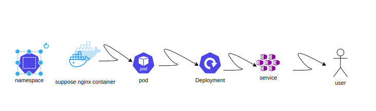

# Kubernetes Architecture Explained

This document explains the key components that make up the architecture of a Kubernetes cluster, in simple terms, with additional depth and real-world examples.

---

## Table of Contents

- [Control Plane (Master Node Components)](#control-plane-master-node-components)
- [Worker Node Components](#worker-node-components)
- [Other Components](#other-components)
- [Real-World Examples](#real-world-examples)

---

---

## Control Plane (Master Node Components)

### API Server

The **API Server** is the primary entry point for all administrative tasks in a Kubernetes cluster. It exposes the Kubernetes API, which users, automation scripts, and other Kubernetes components use to communicate with the cluster.

- **Role**: Handles RESTful API calls (e.g., to create a Pod) and communicates with the etcd database.
- **Key Features**: Authentication, authorization, and validation of requests.

**Analogy**: Think of the API Server as a receptionist at a hotel, ensuring guest requests (like booking a room) are directed to the right department.

**Example**: 
- You use `kubectl apply -f deployment.yaml` to deploy an application. This request first reaches the API Server, which processes it and updates the cluster state in etcd.

---

### etcd

**etcd** is a distributed key-value store that acts as the "brain" of Kubernetes. It stores all cluster data, including configuration, metadata, and state.

- **Role**: Persistent storage of cluster information.
- **Key Features**: High availability and consistency, supporting leader election for cluster operations.

**Analogy**: It's like a shared online document where everyone records the current state of a team project.

**Example**: 
- If you delete a Pod, the API Server updates the etcd database. This ensures the change is reflected across all Kubernetes components.

---

### Scheduler

The **Scheduler** determines which Node is the best fit to run a Pod based on resource availability and constraints.

- **Role**: Assigns workloads to Nodes based on CPU, memory, and affinity/anti-affinity rules.
- **Key Features**: Resource optimization and workload balancing.

**Analogy**: Imagine a travel agent assigning hotel rooms based on preferences and availability.

**Example**: 
- If you deploy a web app needing 2 CPUs and 1GB RAM, the Scheduler finds a Node with sufficient resources to run it.

---

### Controller Manager

The **Controller Manager** runs various controllers, each responsible for ensuring a specific aspect of the cluster's desired state matches its actual state.

- **Controllers**: Node Controller, Deployment Controller, Job Controller, etc.
- **Role**: Continuously monitors and adjusts cluster components to maintain the desired state.

**Analogy**: It's like a fleet of maintenance bots ensuring a theme park operates smoothly—replacing broken lights, refilling food stalls, etc.

**Example**: 
- If a Pod crashes, the Deployment Controller automatically spins up a new one to replace it.

---

### Cloud Controller Manager

The **Cloud Controller Manager** enables integration with cloud providers for managing resources like load balancers, volumes, and nodes.

- **Role**: Abstracts cloud-specific operations from the Kubernetes cluster.
- **Key Features**: Ensures portability across different cloud environments.

**Example**: 
- If you’re using AWS, the Cloud Controller Manager provisions an Elastic Load Balancer (ELB) for your Service.

---

## Worker Node Components

### kubelet

The **kubelet** is the agent that runs on each Node and ensures that containers are running as expected.

- **Role**: Communicates with the API Server to receive instructions and monitor the health of Pods.
- **Key Features**: Pod lifecycle management.

**Example**: 
- If the Scheduler assigns a Pod to a Node, the kubelet pulls the necessary container image and starts the Pod.

---

### kube-proxy

The **kube-proxy** manages network communication in the cluster, ensuring traffic reaches the correct Pod.

- **Role**: Implements network rules for Pod-to-Pod and external-to-Pod communication.
- **Key Features**: Load balancing and service discovery.

**Example**: 
- If a user accesses your app via an external IP, kube-proxy ensures the request is routed to the correct Pod.

---

### Container Runtime

The **Container Runtime** runs and manages containers on a Node. Popular options include Docker, containerd, and CRI-O.

- **Role**: Executes container images and manages their lifecycle.
- **Key Features**: Provides isolation and resource allocation.

**Example**: 
- When you deploy a containerized Node.js app, the runtime pulls the container image and runs it on the Node.

---

## Other Components

### Pod

A **Pod** is the smallest deployable unit in Kubernetes, representing one or more tightly coupled containers.

- **Analogy**: Like an apartment, where containers are roommates sharing resources.
- **Example**: A Pod may contain a web server container and a logging sidecar container.

---

### Service

A **Service** exposes a stable endpoint for accessing Pods, even as Pods are replaced.

- **Analogy**: Like a company's central phone number that routes calls to different employees.
- **Example**: A Service exposes a web app to users via a consistent IP, even if the underlying Pods change.

---

### Ingress

An **Ingress** manages HTTP and HTTPS traffic, routing requests to specific Services based on rules.

- **Analogy**: A receptionist directing visitors to the right department in an office.
- **Example**: A single domain (`example.com`) routes traffic to different Services for `/api` and `/frontend`.

---

### Namespace

A **Namespace** partitions cluster resources for different teams or applications.

- **Example**: Dev, test, and prod environments can each have their own Namespace.

---

## Real-World Examples

### E-commerce Application
Imagine an online store with multiple microservices:

1. **Frontend**: Serves the user interface.
   - Pods running React, exposed via an Ingress.
2. **Catalog Service**: Manages product data.
   - StatefulSet for etcd to store catalog data.
3. **Cart Service**: Handles user carts.
   - Deployment with replicas for scaling.
4. **Payment Gateway**: Processes payments.
   - Service with a LoadBalancer for external access.

---

### Video Streaming Service
A video platform like YouTube or Netflix:

1. **Video Processor**: Converts raw video into streaming formats.
   - Jobs scheduled on demand.
2. **Recommendation Engine**: Provides personalized content.
   - Deployment with Machine Learning models.
3. **Content Delivery**: Serves videos to users.
   - Uses Services and kube-proxy for high availability.
4. **User Management**: Manages profiles and subscriptions.
   - Stateless microservices with database connections.

---

With Kubernetes, you can efficiently manage complex applications, ensuring scalability, reliability, and portability across different environments.

### Process of creation
simplly--kubectl run nginx --image=nginx 
